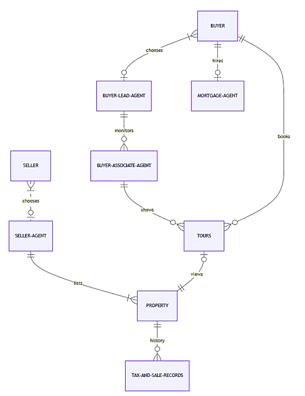

# Design Document

By Preeti Manoharan

Video overview: https://youtu.be/PRVsdTHPGew

## Scope
The database for a real estate brokerage company would include all the entities necessary to facilitate the process of tracking houses being put on the market and their subsequent purchases and sales. As such, included in the database's scope is:

* Property, including basic identifying information
* Property tax and sale records, including taxes paid every year and all transactions since construction
* Buyer, including basic identifying information
* Seller, including basic identifying information
* Buyer Lead Agents, including basic identifying information of agent assigned by brokerage company
* Buyer Associate Agents, including basic identifying information and hierarchy
* Mortgage Agent, including basic identifying information
* Seller Agent, including basic identifying information
* Tours booked by buyers, including the time selected, and the property to which the tour is related

Out of scope are elements of property management like rentals, commercial properties and other non-sale transactions.

## Functional Requirements

This database will support:

* Create, Read, Update, and Delete operations for buyers, sellers, property, agents, and tours
* Tracking purchases and sales of properties

## Representation

Entities are captured in SQLite tables with the following schema.

### Entities

The database includes the following entities:

#### Property

The `property` table includes:
* `id`, which specifies the unique ID for the property as an `INTEGER`. This column thus has the `PRIMARY KEY` constraint applied.
* `address`, which specifies the property's location as `TEXT`, given `TEXT` is appropriate for address fields. A `UNIQUE` constraint ensures no two properties have the same address.
* `listing price`, which specifies the property's asking price as `INTEGER`, given `INTEGER` is appropriate for price information, and dollar is the default currency.
* `bedrooms`, which specifies the number of bedrooms in the property as`INTEGER`, given `INTEGER` is appropriate for number fields.
* `bathrooms`, which specifies the number of bathrooms in the property as `REAL`. `REAL` is used to allow the incorporation of half bathrooms i.e. powder rooms.
* `type`, which specifies the property type as `TEXT`. CHECK constraint will restrict the house types to be one among single family home, townhome, condo, land, multiple family, mobile, co-cop or other.
* `year`, which specifies the build year of the property as `INTEGER`. CHECK constraint will ensure that the data entered into the `year` column fit the pattern of either 18%%, 19%% or 20%%.
* `status`, which specifies the status of the property as `TEXT`. CHECK constraint will restrict the status to be one among For Sale - Active, Under Contract, Bids Received, or others.
* `description`, which gives details about the property such as recent renovations, community restrictions, and highlights any particular aspects of the property, including school districts. The data type would be `TEXT`.

All the columns except description are required and hence have the `NOT NULL` constraint applied where a `PRIMARY KEY` or `FOREIGN KEY` constraint is not.

#### Buyer

The `buyer` table includes:

* `id`, which specifies the unique ID for the buyer as an `INTEGER`. This column thus has the `PRIMARY KEY` constraint applied.
* `first_name`, which specifies the buyer's first name as `TEXT`.
* `last_name`, which specifies the buyer's last name as `TEXT`.
* `phone_number`, which is the contact information of the buyer stored as an `INTEGER`. A CHECK constraint will ensure that this field has a number of 10 digits entered. This must be a unique value.
* `email_id`, which is the contact information of the buyer stored as an `TEXT`. A CHECK constraint will ensure the pattern of having an "@" symbol followed by some letters and ends with ".com". This must be a unique value.

All columns are required and hence have the `NOT NULL` constraint applied where a `PRIMARY KEY` or `FOREIGN KEY` constraint is not.

#### Mortgage Agent

The `mortgage_agent` table includes:

* `id`, which specifies the unique ID for the mortgage agent as an `INTEGER`. This column thus has the `PRIMARY KEY` constraint applied.
* `first_name`, which specifies the mortgage agent's first name as `TEXT`.
* `last_name`, which specifies the mortgage agent's last name as `TEXT`.
* `buyer_id` which is the ID of the buyer to whom this mortgage agent has been assigned as an `INTEGER`. This column thus has the `FOREIGN KEY` constraint applied, referencing the `id` column in the `buyer` table to ensure data integrity.

All columns are required and hence have the `NOT NULL` constraint applied where a `PRIMARY KEY` or `FOREIGN KEY` constraint is not.

#### Buyer Lead Agent

The `buyer_lead_agent` table includes:

* `id`, which specifies the unique ID for the buyer lead agent as an `INTEGER`. This column thus has the `PRIMARY KEY` constraint applied.
* `first_name`, which specifies the buyer lead agent's first name as `TEXT`.
* `last_name`, which specifies the buyer lead agent's last name as `TEXT`.
* `phone_number`, which is the contact information of the buyer lead agent stored as an `INTEGER`. A CHECK constraint will ensure that this field has a number of 10 digits entered.
* `buyer_id` which is the ID of the buyer to whom this lead agent has been assigned as an `INTEGER`. This column thus has the `FOREIGN KEY` constraint applied, referencing the `id` column in the `buyer` table to ensure data integrity.

All columns are required and hence have the `NOT NULL` constraint applied where a `PRIMARY KEY` or `FOREIGN KEY` constraint is not.

#### Buyer Associate Agent

The `buyer_associate_agent` table includes:

* `id`, which specifies the unique ID for the buyer associate agent as an `INTEGER`. This column thus has the `PRIMARY KEY` constraint applied.
* `first_name`, which specifies the buyer associate agent's first name as `TEXT`.
* `last_name`, which specifies the buyer associate agent's last name as `TEXT`.
* `phone_number`, which is the contact information of the buyer associate agent stored as an `INTEGER`. A CHECK constraint will ensure that this field has a number of 10 digits entered. This must be a unique value.
* `lead_agent_id` which is the ID of the buyer lead agent to whom this associate agent reports . This column thus has the `FOREIGN KEY` constraint applied, referencing the `id` column in the `buyer` table to ensure data integrity.

All columns are required and hence have the `NOT NULL` constraint applied where a `PRIMARY KEY` or `FOREIGN KEY` constraint is not.

#### Tours

The `tours` table includes:

* `id`, which specifies the unique ID for the tour as an `INTEGER`. This column thus has the `PRIMARY KEY` constraint applied.
* `date`, which specifies the date for which the buyer books a showing as `DATETIME`.
* `property_id`, as an `INTEGER` which is the ID of the property for which the tour is booked. This column thus has the `FOREIGN KEY` constraint applied, referencing the `id` column in the `property` table to ensure data integrity.
* `buyer_id` as an `INTEGER` which is the ID of the buyer who has booked the tour. This column thus has the `FOREIGN KEY` constraint applied, referencing the `id` column in the `buyer` table to ensure data integrity.
* `associate_agent_id`, as an `INTEGER` which is the ID of the associate agent who is available at the time the tour is booked for. This column thus has the `FOREIGN KEY` constraint applied, referencing the `id` column in the `buyer_associate_agent` table to ensure data integrity.

All columns are required and hence have the `NOT NULL` constraint applied where a `PRIMARY KEY` or `FOREIGN KEY` constraint is not.

#### Property tax and sale records

The `tax_and_sale_records` table includes:

* `id`, which specifies the unique ID for the record as an `INTEGER`. This column thus has the `PRIMARY KEY` constraint applied.
* `tax_year`, which specifies the tax year of the property as `INTEGER`. CHECK constraint will ensure that the data entered into the `year` column fit the pattern of either 19%% or 20%%.
* `tax_amount`, which specifies the property tax for the particular year as `INTEGER`.
* `sale_date`, which specifies the sale date of the property as `DATETIME`.
* `sale_amount`, which specifies the property tax for the particular year as `INTEGER`.
* `property_id`, as an `INTEGER` which is the ID of the property for which the record is being kept. This column thus has the `FOREIGN KEY` constraint applied, referencing the `id` column in the `property` table to ensure data integrity.

All columns are not required since tax would be levied each year but sale need not happen, so the `NOT NULL` constraint cannot be applied.

#### Seller

The `seller` table includes:

* `id`, which specifies the unique ID for the seller as an `INTEGER`. This column thus has the `PRIMARY KEY` constraint applied.
* `first_name`, which specifies the seller's first name as `TEXT`.
* `last_name`, which specifies the seller's last name as `TEXT`.
* `phone_number`, which is the contact information of the seller stored as an `INTEGER`. A CHECK constraint will ensure that this field has a number of 10 digits entered. This must be a unique value.
* `email_id`, which is the contact information of the seller stored as an `TEXT`. A CHECK constraint will ensure the pattern of having an "@" symbol followed by some letters and ends with ".com". This must be a unique value.

All columns are required and hence have the `NOT NULL` constraint applied where a `PRIMARY KEY` or `FOREIGN KEY` constraint is not.

#### Seller Agent

The `seller_agent` table includes:

* `id`, which specifies the unique ID for the seller agent as an `INTEGER`. This column thus has the `PRIMARY KEY` constraint applied.
* `first_name`, which specifies the seller agent's first name as `TEXT`.
* `last_name`, which specifies the seller agent's last name as `TEXT`.
* `phone_number`, which is the contact information of the seller agent stored as an `INTEGER`. A CHECK constraint will ensure that this field has a number of 10 digits entered. This must be a unique value.
* `seller_id` which is the ID of the seller to whom this seller agent has been assigned as an `INTEGER`. This column thus has the `FOREIGN KEY` constraint applied, referencing the `id` column in the `seller` table to ensure data integrity.

All columns are required and hence have the `NOT NULL` constraint applied where a `PRIMARY KEY` or `FOREIGN KEY` constraint is not.

### Relationships
The below entity relationship diagram describes the relationships among the entities in the database.

As detailed by the diagram:

* A buyer could hire a mortgage agent but may choose not to. From the perspective of the real estate brokerage company, if a mortgage agent is indeed hired, the agent will be having a one-to-one relationship with the buyer i.e. the agent may service other buyers as well, but that would be information beyond the brokerage company's interest.
* Likewise, a seller could choose to work with multiple brokerage companies, but those other relationships would be outside the scope of this brokerage company and from its perspective, there will be a one-to-one relationship with the seller agent assigned to the seller. The fact that the seller may not choose this brokerage company at all is reflected by the zero or one relationship from the seller's side, and this would still be included because the brokerage company would have information of the listing even if the seller does not choose to work with them. The agent on the other hand, will be working with multiple sellers who chose the brokerage company. The seller agent would be working to sell all the properties listed by the sellers they are working with i.e. many properties, but each property would be assigned to a particular seller agent.
* Similarly, the buyer may or may not choose to work with the brokerage company, but as long as one side of the transaction is being serviced by the company, it will have information of the other party, and therefore, this information will be captured in the ER diagram. The agent on the other hand, will be working with multiple buyers who chose the brokerage company.
* There are usually several agents working for the buyer's side as they have to conduct showings for various properties before a transaction is entered into. This is arranged by having a lead agent assigned to the buyer, who then has several associate agents reporting to them. This hierarchy is shown as an associate reporting to one lead agent but the lead agent having several associate agents or none reporting to them.
* The buyer may choose to book tours for the properties that interest them. A tour is booked by a particular buyer.
* The tours have to be conducted by the associate agents but a particular associate agent may not have conducted any showing e.g. while under training. Each tour is for a particular property, but a particular property may not have had any tours.
* The property may or may not have any tax and sale records for e.g. a new construction would not have these details, but the tax and sale records are with regard to particular properties.

## Optimizations

The most common search in a real estate brokerage company's database would be for properties matching certain requirements by the buyer. Hence, an index has been created on the most important filters i.e. "listing price", "type","year", and "status" to speed up the search of the property table for identifying the properties which fit the buyer's criteria.

From the brokerage company's perspective, planning tours booked by buyers, as well maintaining a hierarchy among the agents is important. Accordingly, indexes are created for both of these to speed their organization and planning.

Since planning tours is an everyday activity and it connects multiple tables, a view has been created for optimization, for all the information that would be necessary to carry out the property viewings.

## Limitations

The current schema can allow for double booking of tours i.e. the same associate agent could be assigned to multiple tours at the same time or one buyer can book multiple tours for the same time. There is also no check against duplicate entries in any table. Moreover, tours cannot be organized for efficiency based on their locations nor is there any check regarding availability of the assigned associate agent. Also, while tours can be conducted by either the lead or associate agent, the schema only allows associate agents to handle tours.

Negotiations between seller and buyer through their respective agents in the form of bids, counter offers etc. also cannot be captured very well in this schema. Only the details of the final sale transaction will be recorded.
